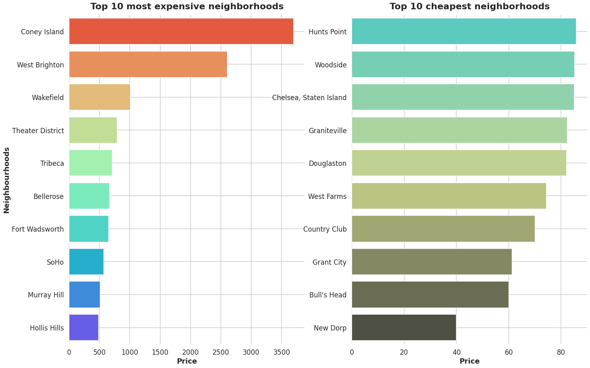

<h3 align="center">2022 NYC Airbnb Analytics</h3>

  A deeper understanding of the NYC Airbnb market.
   
  <a href="http://insideairbnb.com/get-the-data/"><strong>Explore Airbnb Dataset »</strong></a>

## Table of Contents
1. [Installation](#installation)
2. [Project Motivation](#motivation)
3. [File Descriptions](#files)
4. [Results](#results)
5. [Licensing, Authors, and Acknowledgements](#licensing)

## Installation 
- Python >= 3.6 
- Plotly ~= 5.13.0
- Matplotlib ~= 3.6.3
- Seaborn ~= 0.12.2
- Folium  ~= 0.14.0

## Project Motivation

The vacation rental industry has grown rapidly in recent years, with Airbnb being one of the largest players in the market. With the increasing popularity of Airbnb, understanding the data behind this industry can provide valuable insights for both businesses and tourists.

This project aims to conduct a comprehensive analysis of the 2022 NYC Airbnb dataset to answer the following questions:

**For businesses:**
-  Who are the top hosts with the most listings in NYC?
-  What are the most popular neighborhoods in each borough in NYC?
-  What are the most expensive and cheapest neighborhoods in NYC?
-  What is the distribution of average listing prices across neighborhoods in NYC?
-  How much of a particular home is available on average?
-  How much do prices fluctuate in 2022?
-  What are the most commonly used words in listing names and amenities in NYC?

**For tourists:**
-  What are the top 10 reviewed listings in NYC?
-  What is the character and vibe of each neighborhood in NYC?
-  What are the budget-friendly neighborhoods in NYC?

By answering these questions, this project can provide valuable insights into the competitive landscape of the Airbnb market in NYC and assist businesses in determining areas with the highest demand or potential for growth, as well as setting competitive prices. 

It can also provide tourists with information on highly rated listings, budget-friendly neighborhoods, and the unique character and vibe of each neighborhood in NYC.
## File Descriptions 
The 'analysis.ipynb' file includes all the steps taken to answer the questions. It covers data cleaning and preprocessing, data visualization, and drawing conclusions from the data.

There are also three NYC Airbnb dataset files included, which were downloaded from <a href="http://insideairbnb.com/get-the-data/"><strong>Inside Airbnb</strong></a>:
1. listings.csv.gz: contains all information about listings and hosts.
2. reviews.csv.gz: includes the reviews for each listing.
3. calendar.csv.gz: includes records of prices, availabilities, and other details from the listing's calendar for each day of the next 365 days.

## Results

    
    

## Licensing
The NYC Airbnb dataset was downloaded from <a href="http://insideairbnb.com/">Inside Airbnb</a> and is licensed under a <a href="https://creativecommons.org/licenses/by/4.0/">Creative Commons Attribution 4.0 International License.</a>. 

The code in this repository is released under MIT License.

